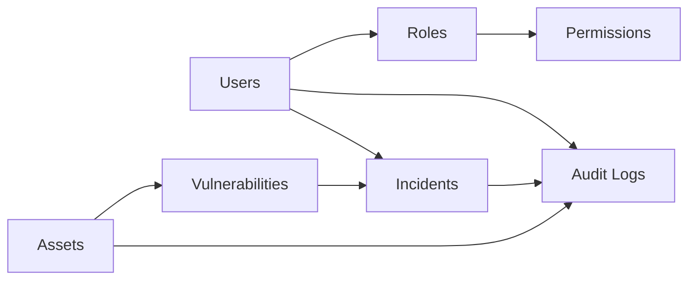
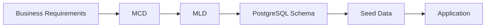
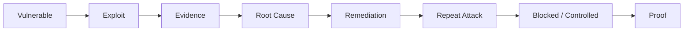

#  SecureCorp DB

<p align="center">
  
</p>

<p align="center"><strong>BUILD → BREACH → HARDEN</strong><br>
A controlled database security engineering laboratory.</p>

<p align="center">


</p>

---

##  The idea

SecureCorp DB is not just a database project.

It is a full engineering loop:

```text
BUSINESS REQUIREMENTS
        ↓
      MCD
        ↓
      MLD
        ↓
   POSTGRESQL
        ↓
 APPLICATION LAYER
        ↓
     ATTACK
        ↓
  ROOT CAUSE
        ↓
    HARDEN
        ↓
     RETEST
        ↓
      PROVE
```

The system is first designed correctly, then deliberately weakened in a controlled lab, attacked, repaired, and tested again.

> **Build it. Break it. Understand why it broke. Fix it. Prove that it is fixed.**

---

## 🏢 What is SecureCorp?

SecureCorp represents a fictional internal security platform managing:

```text
Users
Roles
Permissions
Assets
Vulnerabilities
Incidents
Audit Logs
```



The model is deliberately small enough to reason about and rich enough to produce real database and security problems.

---

# 🟢 Phase 1 — BUILD

### Design before implementation

The project begins with business rules, not random tables created until pgAdmin starts looking worried.



### MCD → MLD → PostgreSQL

The conceptual model defines:

- entities
- attributes
- identifiers
- associations
- cardinalities
- N:N relationships
- association properties
- historical information

A typical N:N structure becomes an associative relation:

```text
ROLE  N ───────< ROLE_PERMISSION >─────── N  PERMISSION
```

The relational model is then implemented with database-level integrity:

```text
PRIMARY KEY
FOREIGN KEY
NOT NULL
UNIQUE
CHECK
```

### Build deliverables

```text
docs/business-requirements.md
docs/mcd.md
docs/mld.md
docs/normalization.md
database/schema.sql
database/seed.sql
diagrams/mcd.png
diagrams/mld.png
```

---

# 🔴 Phase 2 — BREACH

The application layer is intentionally vulnerable.

The goal is not to attack somebody else's infrastructure. The goal is to understand exactly how insecure application/database interactions fail inside our own laboratory.

## 01 · SQL Injection

Unsafe flow:

```text
User Input
   ↓
String Concatenation
   ↓
SQL Parser
   ↓
Unexpected Query
   ↓
Database Impact
```

The lab covers:

- Error-based SQL injection
- UNION-based SQL injection
- Boolean-based blind SQL injection
- Time-based blind SQL injection

Manual exploitation comes first. Automation such as `sqlmap` is used as independent validation.

## 02 · Race Condition

A deliberately unsafe check-then-act operation creates a concurrency window:

```text
Request A ──► SELECT ──► CHECK ──► UPDATE
Request B ──► SELECT ──► CHECK ──► UPDATE
                       ▲
                       │
                   RACE WINDOW
```

This connects application behavior to:

`transactions · MVCC · isolation · locking · concurrency`

## 03 · Excessive Privileges

The application initially receives more database permissions than it actually needs:

```text
                APPLICATION
                     │
                     ▼
          OVER-PERSONED DB ACCOUNT
                     │
          ┌──────────┼──────────┐
          ▼          ▼          ▼
        READ       WRITE     SENSITIVE
                             MODIFICATION
```

The experiment demonstrates how a weak privilege boundary can increase the impact of application compromise.

---

# 🔵 Phase 3 — HARDEN

Hardening is not a sentence in a report saying “fixed.”

The original attack is repeated.



### SQL Injection → Parameterized SQL

```python
query = "SELECT * FROM users WHERE name = %s"
cursor.execute(query, (username,))
```

The important thing is not the syntax. It is the separation between **data** and **SQL instructions**.

### Race Condition → Transactional Protection

Depending on the state transition, the hardened implementation may use transactions, row locking, or an appropriate isolation strategy.

Example:

```sql
BEGIN;

SELECT ...
FOR UPDATE;

UPDATE ...;

COMMIT;
```

### Excessive Privilege → Least Privilege

```text
app_readonly
    ↓
read-only operations

app_write
    ↓
required DML only

app_admin
    ↓
restricted administrative tasks
```

Each account should receive only the permissions necessary for its role.

---

# 🧱 Defense in Depth

The application is not the only security boundary.

The database also protects its own state:

```text
Application Controls
        +
Database Constraints
        +
Transactions
        +
Locks
        +
Roles / Privileges
        ↓
Defense in Depth
```

The principle is simple:

> **An application bug should not automatically become a valid database state.**

---

# 🔬 Performance Validation

Security controls are tested without pretending performance is someone else's problem.

Key queries will be examined with:

```sql
EXPLAIN ANALYZE
```

Changes are driven by measurement:

```text
Measure
  ↓
Observe
  ↓
Reason
  ↓
Change
  ↓
Re-measure
```

Indexes are introduced when evidence supports them, not because a project contains the word “database.”

---

# 🧪 Laboratory Boundaries

All offensive testing is designed for the local, intentionally vulnerable environment.

```text
localhost / private lab
        ↓
fictional data
        ↓
intentional vulnerabilities
        ↓
controlled evidence
```

No real personal data or third-party infrastructure is required.

---

# 🛠️ Stack

| Layer | Technology |
|---|---|
| Database | PostgreSQL |
| Application | Python + Flask / minimal CLI |
| Driver | psycopg / psycopg2 |
| Infrastructure | Docker + Docker Compose |
| DB clients | `psql`, pgAdmin, DBeaver |
| Security testing | Manual testing, sqlmap |
| HTTP testing | Burp Suite Community |
| Modeling | Merise MCD / MLD |
| Version control | Git + GitHub |
| Documentation | Markdown |

---

# 📁 Repository

```text
securecorp-db/
│
├── README.md
├── docker-compose.yml
├── .env.example
├── .gitignore
│
├── docs/
│   ├── business-requirements.md
│   ├── mcd.md
│   ├── mld.md
│   ├── normalization.md
│   └── decisions.md
│
├── database/
│   ├── schema.sql
│   └── seed.sql
│
├── diagrams/
│   ├── mcd.png
│   └── mld.png
│
├── app/
├── exploits/
├── tests/
├── report/
└── assets/
    └── securecorp-lifecycle.gif
```

---

# 🚀 Run the Lab

Once the environment is implemented:

```bash
git clone <repository-url>
cd securecorp-db
cp .env.example .env
docker compose up -d
docker compose ps
```

Then connect to PostgreSQL with the configured credentials.

The exact environment variables, ports, startup sequence, and initialization behavior will live in the repository documentation.

---

# 📊 What the project proves

```text
                 SECURECORP DB
                       │
        ┌──────────────┼──────────────┐
        ▼              ▼              ▼
      DESIGN         ATTACK         DEFENSE
        │              │              │
     MCD / MLD      SQLi / Race     Params / TX
        │           Privilege Esc.   Least Priv.
        └──────────────┼──────────────┘
                       ▼
                    RETEST
                       │
                       ▼
                     PROOF
```

The final result should let another engineer clone the project, understand the model, run the vulnerable lab, reproduce the documented issues, inspect the fixes, and verify the hardened state.

---

# 🎓 Learning Objectives

## Database Engineering

Requirements analysis, Merise MCD/MLD, relational design, keys, cardinalities, N:N relationships, historization, normalization, PostgreSQL DDL, integrity constraints, realistic seed data, and query analysis.

## SQL

`SELECT` · `JOIN` · `GROUP BY` · subqueries · `CASE` · CTEs · window functions · transactions · locking · `EXPLAIN ANALYZE`

## Cybersecurity

SQL injection, blind SQL injection, race conditions, excessive database privileges, application/database trust boundaries, and integrity failures.

## Defensive Engineering

Parameterized SQL, transactional protection, least privilege, constraints, defense in depth, and security regression testing.

---

# 🧭 Milestones

```text
01  BUSINESS MODEL
      ↓
02  MCD / MLD
      ↓
03  POSTGRES LIVE
      ↓
04  SEED DATA
      ↓
05  VULNERABLE APP
      ↓
06  FIRST EXPLOIT
      ↓
07  RACE CONDITION
      ↓
08  PRIVILEGE ESCALATION
      ↓
09  HARDENING
      ↓
10  RETEST
      ↓
11  PERFORMANCE
      ↓
12  FINAL REPORT
```

---

# ✅ Definition of Done

The project is complete when another engineer can:

```text
clone
  ↓
start
  ↓
inspect
  ↓
understand
  ↓
exploit
  ↓
collect evidence
  ↓
harden
  ↓
retest
  ↓
measure
  ↓
verify
```

The finish line is therefore not “the tables exist.”

It is **reproducibility + exploitation + remediation + verification**.

---

# 🔐 Final Principle

```text
DESIGN
  ↓
IMPLEMENT
  ↓
MEASURE
  ↓
BREAK
  ↓
UNDERSTAND
  ↓
HARDEN
  ↓
RETEST
  ↓
PROVE
```

> **The database is the system.**  
> **The attack is the experiment.**  
> **The fix is the engineering.**  
> **The retest is the proof.**

<p align="center"><sub>SecureCorp DB · Build → Breach → Harden</sub></p>
