<div align="center">

```
 ██████╗ ███████╗ ██████╗██╗   ██╗██████╗ ███████╗
 ██╔════╝ ██╔════╝██╔════╝██║   ██║██╔══██╗██╔════╝
 ██║  ███╗█████╗  ██║     ██║   ██║██████╔╝█████╗
 ██║   ██║██╔══╝  ██║     ██║   ██║██╔══██╗██╔══╝
 ╚██████╔╝███████╗╚██████╗╚██████╔╝██║  ██║███████╗
  ╚═════╝ ╚══════╝ ╚═════╝ ╚═════╝ ╚═╝  ╚═╝╚══════╝
         C O R P   ·   D B   S E C U R I T Y   L A B
```

### `BUILD` → `BREACH` → `HARDEN`

**A controlled database security engineering laboratory — design a real schema, attack it, understand why it broke, fix it, and prove the fix.**

<br>


<sub>⚠️ Static badges above are safe to keep as-is. If you want live GitHub stats (stars, last commit, issues), replace <code>OWNER/REPO</code> in the badge URLs at the bottom of this file with your actual GitHub path.</sub>

</div>

<br>

---

## 📑 Table of Contents

- [The Idea](#-the-idea)
- [What is SecureCorp?](#-what-is-securecorp)
- [Data Model](#-data-model)
- [Repository Structure](#-repository-structure)
- [Phase 1 — Build](#-phase-1--build)
- [Phase 2 — Breach](#-phase-2--breach)
- [Phase 3 — Harden](#-phase-3--harden)
- [Defense in Depth](#-defense-in-depth)
- [Performance Validation](#-performance-validation)
- [Tech Stack](#️-tech-stack)
- [Running the Lab](#-running-the-lab)
- [Learning Objectives](#-learning-objectives)
- [Roadmap](#-roadmap)
- [Definition of Done](#-definition-of-done)
- [Final Principle](#-final-principle)

---

## 💡 The Idea

SecureCorp DB is not a schema demo. It is a closed engineering loop, run twice — once broken, once fixed — with evidence at every step.

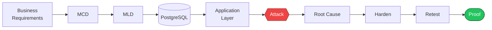

> **Build it. Break it. Understand why it broke. Fix it. Prove that it is fixed.**

Every vulnerability in this lab is introduced deliberately, exploited manually first, documented with evidence, then remediated and re-tested against the exact same exploit. Nothing is "fixed" without a passing regression test to prove it.

---

## 🏢 What is SecureCorp?

A fictional internal security platform — small enough to reason about fully, realistic enough to produce genuine database and application security problems.

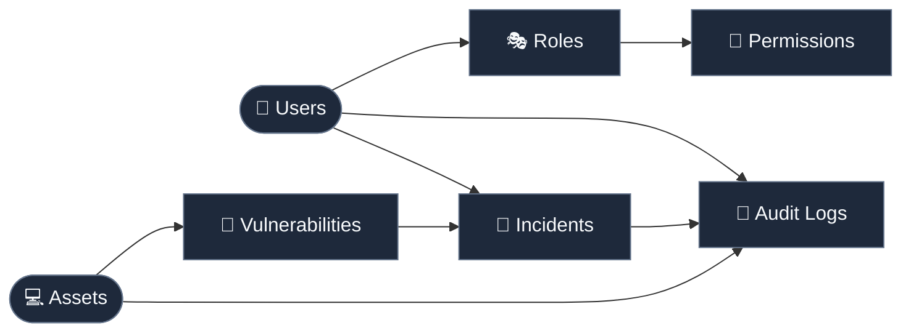

| Entity | Purpose |
|---|---|
| **Users** | Identities interacting with the platform |
| **Roles / Permissions** | RBAC — the N:N relationship at the center of the privilege-escalation lab |
| **Assets** | Systems/resources tracked by SecureCorp |
| **Vulnerabilities** | Findings linked to assets — feeds the incident pipeline |
| **Incidents** | Triggered by users or vulnerabilities |
| **Audit Logs** | Immutable trail — every state change is observable |

---

## 🗄️ Data Model

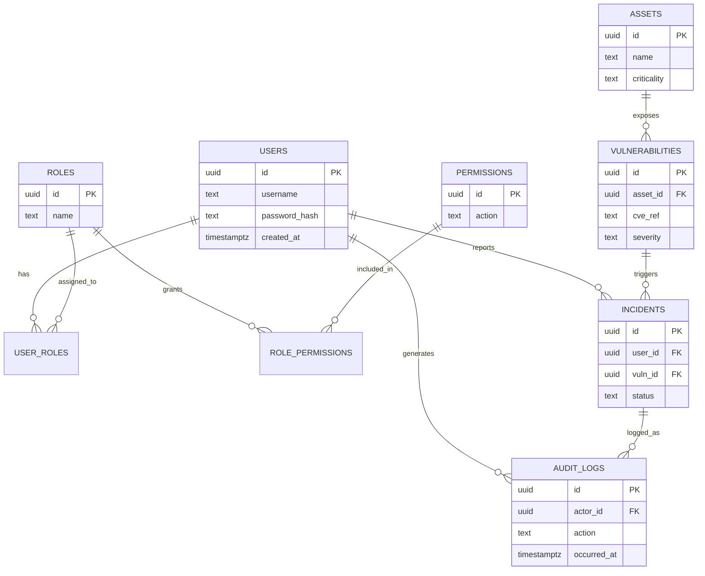

`MCD → MLD` documentation for this schema lives in [`docs/mcd.md`](docs/mcd.md) and [`docs/mld.md`](docs/mld.md), with source diagrams under [`diagrams/`](diagrams/).

---

## 📂 Repository Structure

```text
securecorp-db/
│
├── .github/                          # CI / workflow configuration
│
├── app/                              # Application layer (Flask / CLI) — vulnerable + hardened variants
│
├── database/                         # Schema, constraints, seed data, DB roles
│
├── diagrams/
│   ├── MCD_Project_Sentinel_V1.drawio
│   ├── Mcd secops completed_v2.drawio
│   └── .gitkeep
│
├── docs/
│   ├── business-requirements.md      # Functional & security requirements
│   ├── decisions.md                  # Architecture Decision Records (ADR-style)
│   ├── mcd.md                        # Conceptual data model
│   └── mld.md                        # Logical data model
│
├── exploits/                         # Proof-of-concept exploit scripts, one per vulnerability
│
├── report/                           # Evidence: before/after, EXPLAIN ANALYZE output, retest logs
│
├── .env.example                      # Environment variable template
├── .gitignore
├── docker-compose.yml                # PostgreSQL + app orchestration
└── README.md
```

<details>
<summary><strong>📌 Naming note (click to expand)</strong></summary>

<br>

The two `.drawio` files in `diagrams/` currently carry version suffixes and inconsistent casing/spacing (`MCD_Project_Sentinel_V1.drawio`, `Mcd secops completed_v2.drawio`). Git already tracks version history, so a single `mcd.drawio` (kept current via commits, not filename suffixes) would be more maintainable going forward — worth a quick rename pass before the repo is portfolio-facing.

</details>

---

## 🟢 Phase 1 — Build

Design precedes implementation. No table is created before the business rule behind it is written down.

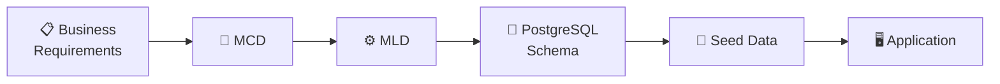

**Conceptual model defines:** entities · attributes · identifiers · associations · cardinalities · N:N relationships · association properties · historization

**N:N → associative relation:**

```text
ROLE  N ───────< ROLE_PERMISSION >─────── N  PERMISSION
```

**Enforced at the database level:**

`PRIMARY KEY` · `FOREIGN KEY` · `NOT NULL` · `UNIQUE` · `CHECK`

**Deliverables:**

- [x] `docs/business-requirements.md`
- [x] `docs/mcd.md`
- [x] `docs/mld.md`
- [ ] `docs/normalization.md`
- [ ] `database/schema.sql`
- [ ] `database/seed.sql`

---

## 🔴 Phase 2 — Breach

The application layer is deliberately vulnerable. The target is our own lab, not third-party infrastructure — every exploit here runs against `localhost`.

### 01 · SQL Injection

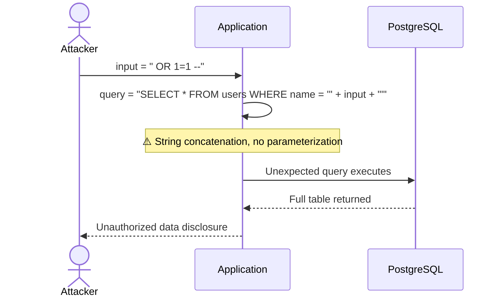

Covered manually before any automation: **error-based · UNION-based · boolean-blind · time-blind**. `sqlmap` is used only as an independent validation pass afterward, never as the discovery method.

### 02 · Race Condition

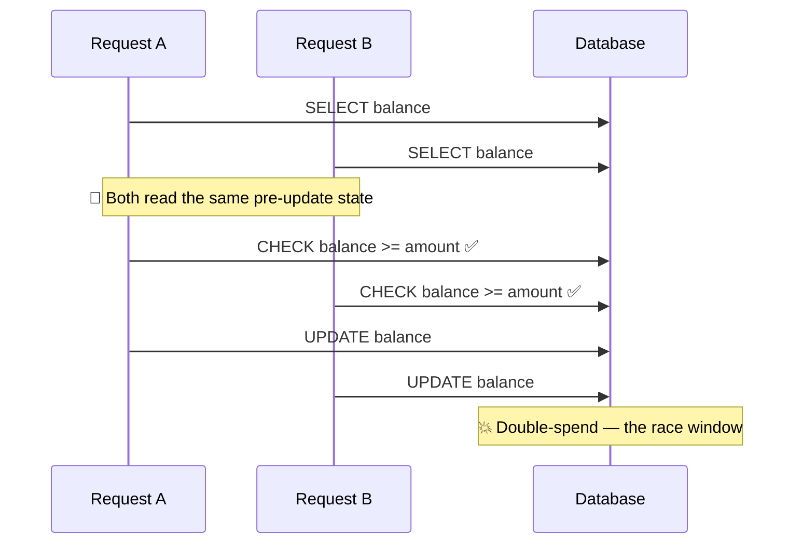

Connects application behavior directly to `transactions` · `MVCC` · `isolation levels` · `locking` · `concurrency`.

### 03 · Excessive Privileges

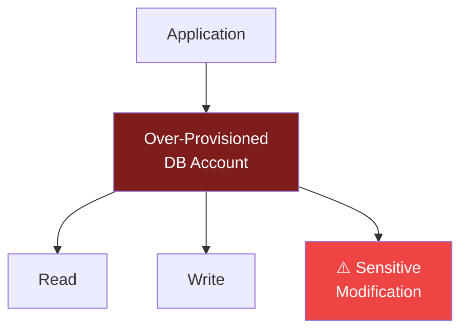

Demonstrates how a weak privilege boundary amplifies the blast radius of any single application compromise.

---

## 🔵 Phase 3 — Harden

Hardening is not a sentence in a report saying "fixed." The original exploit is re-run against the patched system, and the result is recorded as evidence.

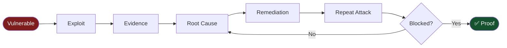

<table>
<tr>
<th>Vulnerability</th>
<th>Root Cause</th>
<th>Fix</th>
</tr>
<tr>
<td><strong>SQL Injection</strong></td>
<td>User input concatenated into SQL text</td>
<td>

```python
query = "SELECT * FROM users WHERE name = %s"
cursor.execute(query, (username,))
```

Separates **data** from **instructions** — the actual fix, not the syntax.

</td>
</tr>
<tr>
<td><strong>Race Condition</strong></td>
<td>Unprotected check-then-act sequence</td>
<td>

```sql
BEGIN;
SELECT ... FOR UPDATE;
UPDATE ...;
COMMIT;
```

Row-level locking (or a stricter isolation level, depending on the state transition) closes the race window.

</td>
</tr>
<tr>
<td><strong>Excessive Privilege</strong></td>
<td>One account, all permissions</td>
<td>

```text
app_readonly  → read-only operations
app_write     → required DML only
app_admin     → restricted admin tasks
```

Each role receives only what its function requires.

</td>
</tr>
</table>

---

## 🧱 Defense in Depth

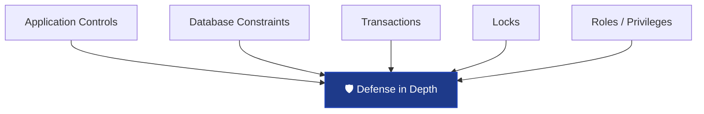

> **An application bug should never automatically become a valid database state.**

---

## 🔬 Performance Validation

Security controls are validated, not assumed — performance is measured, not guessed at.

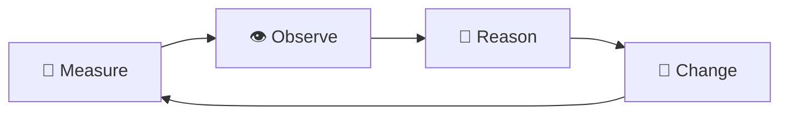

`EXPLAIN ANALYZE` drives every indexing decision. Indexes are added when the query plan justifies them — not because the project happens to contain the word "database."

---

## 🛠️ Tech Stack

| Layer | Technology |
|---|---|
| 🐘 Database | PostgreSQL |
| 🐍 Application | Python + Flask / minimal CLI |
| 🔌 Driver | psycopg / psycopg2 |
| 🐳 Infrastructure | Docker + Docker Compose |
| 🧭 DB Clients | `psql`, pgAdmin, DBeaver |
| 🎯 Security Testing | Manual testing, sqlmap |
| 🌐 HTTP Testing | Burp Suite Community |
| 📐 Modeling | Merise MCD / MLD |
| 🔀 Version Control | Git + GitHub |
| 📝 Documentation | Markdown + Mermaid |

---

## 🚀 Running the Lab

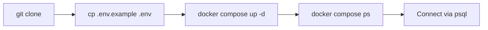

```bash
git clone <repository-url>
cd securecorp-db
cp .env.example .env
docker compose up -d
docker compose ps
```

Exact environment variables, ports, and startup sequence live in [`docs/business-requirements.md`](docs/business-requirements.md) and `.env.example`.

---

## 🎓 Learning Objectives

<table>
<tr><td width="25%" valign="top">

**🗄️ Database Engineering**

- Requirements analysis
- Merise MCD/MLD
- Relational design & keys
- Cardinalities, N:N
- Historization
- Normalization
- PostgreSQL DDL
- Integrity constraints

</td><td width="25%" valign="top">

**📊 SQL**

- `SELECT` / `JOIN`
- `GROUP BY`
- Subqueries
- `CASE`
- CTEs
- Window functions
- Transactions & locking
- `EXPLAIN ANALYZE`

</td><td width="25%" valign="top">

**🔓 Offensive Security**

- SQL injection (all 4 classes)
- Blind SQLi
- Race conditions
- Excessive DB privileges
- App/DB trust boundaries
- Integrity failures

</td><td width="25%" valign="top">

**🛡️ Defensive Engineering**

- Parameterized SQL
- Transactional protection
- Least privilege
- Constraints as controls
- Defense in depth
- Security regression testing

</td></tr>
</table>

---

## 🧭 Roadmap

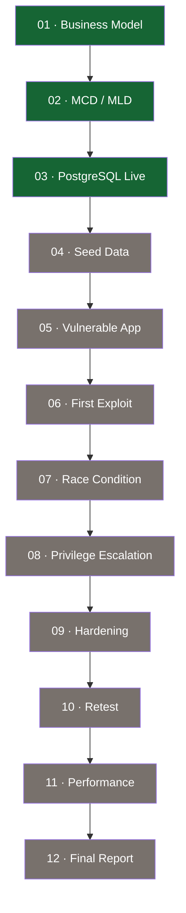

> Green = complete based on current `docs/` contents. Update the styling as milestones close.

---

## ✅ Definition of Done

The project is complete when another engineer can, without asking a single question:

```text
clone → start → inspect → understand → exploit →
collect evidence → harden → retest → measure → verify
```

The finish line is **not** "the tables exist." It is **reproducibility + exploitation + remediation + verification.**

---

## 🔐 Final Principle

<div align="center">

```
DESIGN → IMPLEMENT → MEASURE → BREAK → UNDERSTAND → HARDEN → RETEST → PROVE
```

**The database is the system.**
**The attack is the experiment.**
**The fix is the engineering.**
**The retest is the proof.**

<br>

<sub>SecureCorp DB · Build → Breach → Harden</sub>

</div>

<!--
Optional dynamic badges — replace OWNER/REPO and uncomment:


-->
