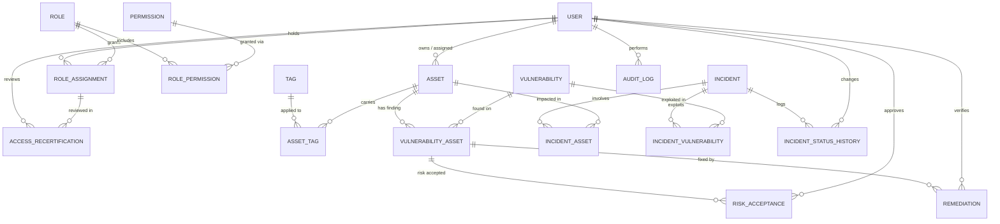

# MCD — Security Operations / GRC Data Model

Conceptual data model covering identity & access management, asset & vulnerability management, incident response, and governance/audit — as completed in `MCD_SecOps_completed.drawio`.

Notation: **PK** = primary key. Cardinalities are written **(min,max)** on each side of a relationship (e.g. `(0,N)` = zero to many, `(1,1)` = exactly one).

---

## 1. Entities

### Identity & Access

**USER**
- **PK** `user_id`
- `full_name`
- `corporate_email`
- `department`
- `employment_status`
- `start_date`

**ROLE**
- **PK** `role_id`
- `role_name`
- `description`

**PERMISSION**
- **PK** `permission_id`
- `permission_name`
- `description`

**ROLE_ASSIGNMENT** *(association: USER ↔ ROLE)*
- **PK** `assignment_id`
- `assigned_date`
- `revoked_date`
- `granted_by`
- `status`

**ROLE_PERMISSION** *(association: ROLE ↔ PERMISSION)*
- ⚠️ still holds placeholder content in the source diagram — needs a real key/attribute set, e.g. **PK** `role_permission_id`, `granted_date`

**ACCESS_RECERTIFICATION** *(reviews a ROLE_ASSIGNMENT)*
- **PK** `recertification_id`
- `review_date`
- `status`
- `reviewer`
- `decision`

### Asset & Vulnerability Management

**ASSET**
- **PK** `asset_id`
- `asset_identifier`
- `name`
- `asset_type`
- `environment`
- `lifecycle_status`

**TAG**
- **PK** `tag_id`
- `tag_name`

**ASSET_TAG** *(association: ASSET ↔ TAG)*
- `tag_id`
- ⚠️ `tag_name` — duplicates `TAG.tag_name`; a clean junction shouldn't repeat data owned by `TAG`

**VULNERABILITY**
- **PK** `vulnerability_id`
- `description`
- `cvss_base_score`
- `severity`
- `discovery_date`
- `discovery_source`
- `status`

**VULNERABILITY_ASSET** *(association: VULNERABILITY ↔ ASSET — "a finding")*
- **PK** `vuln_asset_id` *(typo'd as `vuln_assest` in the source file)*
- `affected_version`
- `detection_date`
- `finding_status`

**RISK_ACCEPTANCE** *(decision not to remediate a finding)*
- **PK** `risk_acceptance_id`
- `justification`
- `acceptance_date`
- `expiration_date`
- `accepting_authority`

**REMEDIATION** *(fix applied to a finding)*
- **PK** `remediation_id`
- `remediation_note`
- `remediation_date`
- `verified_date`
- `verified_by`

### Incident Management

**INCIDENT**
- **PK** `incident_id`
- `detection_time`
- `reporting_source`
- `severity`
- `description`
- `status`

**INCIDENT_ASSET** *(association: INCIDENT ↔ ASSET)*
- **PK** `incident_asset_id`
- `asset_role` — e.g. impacted / source / compromised
- `impact_level`
- `containment_status`

**INCIDENT_VULNERABILITY** *(association: INCIDENT ↔ VULNERABILITY)*
- **PK** `incident_vulnerability_id`
- `exploitation_confirmed`
- `linked_date`
- `notes`

**INCIDENT_STATUS_HISTORY** *(audit trail of an incident's status changes)*
- **PK** `status_history_id`
- `old_status`
- `new_status`
- `changed_at`
- `changed_by`

### Governance & Audit

**AUDIT_LOG** *(generic, system-wide action log)*
- **PK** `audit_log_id`
- `acting_user`
- `timestamp`
- `action_type`
- `entity_type` — polymorphic pointer, not a formal FK
- `record_identifier` — polymorphic pointer, not a formal FK
- `before_values`
- `after_values`

---

## 2. Relationships

| # | Entity A | Cardinality | Cardinality | Entity B | Meaning |
|---|---|---|---|---|---|
| 1 | USER | (0,N) | (0,N)* | ASSET | user owns / is assigned assets |
| 2 | USER | (1,N) | (0,N) | ROLE_ASSIGNMENT | user holds role assignments |
| 3 | ROLE | (1,N) | (0,N) | ROLE_ASSIGNMENT | role granted via assignments |
| 4 | ROLE | (1,N) | (0,N) | ROLE_PERMISSION | role includes permissions |
| 5 | PERMISSION | (1,N) | (0,N) | ROLE_PERMISSION | permission granted via roles |
| 6 | TAG | (1,N) | (0,N) | ASSET_TAG | tag applied to assets |
| 7 | ASSET | (1,N) | (0,N) | ASSET_TAG | asset carries tags |
| 8 | ASSET | (1,N) | (0,N) | VULNERABILITY_ASSET | asset has findings |
| 9 | VULNERABILITY | (1,N) | (0,N) | VULNERABILITY_ASSET | vulnerability found on assets |
| 10 | INCIDENT | (1,N) | (0,N) | INCIDENT_ASSET | incident involves assets |
| 11 | ASSET | (1,N) | (0,N) | INCIDENT_ASSET | asset impacted in incidents |
| 12 | INCIDENT | (1,N) | (0,N) | INCIDENT_VULNERABILITY | incident exploits vulnerabilities |
| 13 | VULNERABILITY | (1,N) | (0,N) | INCIDENT_VULNERABILITY | vulnerability exploited in incidents |
| 14 | INCIDENT | (1,1) | (0,N) | INCIDENT_STATUS_HISTORY | incident's own status log |
| 15 | USER | (1,1) | (0,N) | INCIDENT_STATUS_HISTORY | `changed_by` |
| 16 | VULNERABILITY_ASSET | (1,1) | (0,N) | RISK_ACCEPTANCE | risk accepted on a finding |
| 17 | USER | (1,1) | (0,N) | RISK_ACCEPTANCE | `accepting_authority` |
| 18 | VULNERABILITY_ASSET | (1,1) | (0,N) | REMEDIATION | finding remediated |
| 19 | USER | (1,1) | (0,N) | REMEDIATION | `verified_by` |
| 20 | USER | (1,1) | (0,N) | AUDIT_LOG | `acting_user` |
| 21 | ROLE_ASSIGNMENT | (1,1) | (0,N) | ACCESS_RECERTIFICATION | assignment reviewed |
| 22 | USER | (1,1) | (0,N) | ACCESS_RECERTIFICATION | `reviewer` |

*\*Row 1 is drawn as a direct link (not through an association entity) in the source file, and its exact business meaning (ownership? assignment?) was never labeled — confirm the intended semantics and rename the relationship if needed.*

---

## 3. ER Diagram

---

